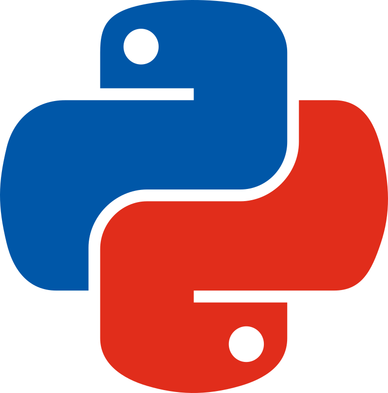

# Community Sponsors

These sponsors are organizations in our community with similar goals as ours. Together,
we strive to strengthen our community, expand it, and make it more inclusive.

---

## Python Chile

**Python Chile** is the official community of the Python programming language in Chile.

[{: class="sponsor-image" style="height: 200px;"}](https://pythonchile.cl/)
