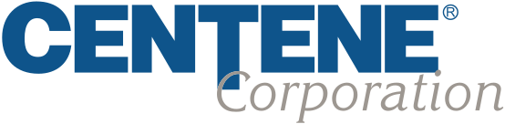
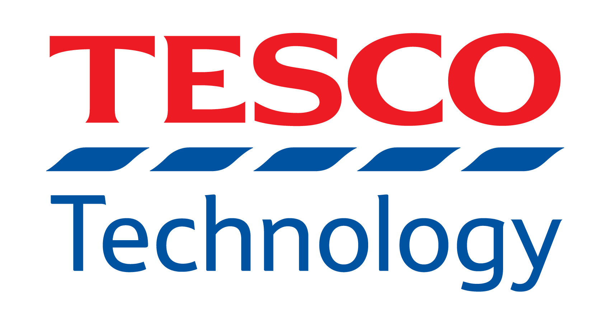

# [Neo4j](https://neo4j.com/careers/)

{: class="sponsor-image"}

Why Join Neo4j?

Neo4j is a privately held Silicon Valley company with a Swedish soul. Based in San Mateo, CA, with offices in Sweden, UK, and Germany. We're a proud equal opportunity employer, fully supporting a global mindset and workforce diversity. You'll love your co-workers!

Our Culture

We aim to hire smart, funny, creative and humble people who possess a lot of heart and drive. We value relationships (just like a graph!) and place trust in our colleagues to meet each day with focus and integrity. We foster collaboration and intellectually honest discussions. Every Neo4j employee is empowered to contribute and put one's own innovative stamp on projects.

We are fanatical about graphs and creating an experience our users love.

## [Data Science Advocate (Remote)](https://jobs.lever.co/neo4j/e556296d-220b-4842-b353-9097b9d9e403)

Responsibilities: Help the data science and related-communities better understand how, when, and why they should consider graphs. Neo4j is extending its capabilities in the data science space with additional functionality for graph data science. Data scientists should be enabled to use contextual connected data to make better predictions and improve the accuracy of their models.

# [Dataiku](https://www.dataiku.com/careers)

{: class="sponsor-image"}

Dataiku is one of the world's leading Enterprise AI and machine learning platforms. 

Dataiku allows enterprises to create value with their data in a human-centered way while breaking down silos and encouraging collaboration. One of the most unique characteristics of our product is the breadth of its scope and the fact that it caters both to technical and non-technical users. 
We are growing fast! 

In 2019, we achieved unicorn status, went from 200 to 400 people, and opened new offices across the globe. 2020 looks no different as we just announced a $100 million Series D in August! At this company no two days are alike but one thing never changed: Dataiku's unique culture described by Dataikers themselves as open, fun and friendly!

## [Full-Stack Engineer DSS - (Paris or Remote, France)](https://www.dataiku.com/company/careers/abc11434-b17c-4549-8678-010a7b0778ad/)

As a full stack developer in the Dataiku engineering team, you will play a crucial role in helping us have a real impact on the daily life of data analysts and scientists. You will be joining one of 3 teams that develop new features and improve existing parts of  Data Science Studio (DSS) based on user feedback. DSS is an on-premises application that connects together all big data technologies.

## [Full-Stack Engineer GovHub - (Paris or Remote, France)](https://www.dataiku.com/company/careers/b4100f5e-5210-42ad-8362-17d574b1aba2/)

As a full stack developer in the Dataiku engineering team, focusing on Governance Hub (GH), you will play a crucial role in helping us bootstrapping this new product. GH is an application that monitor and manage data initiatives across the various departments of a company. It ensures that good practices and governance rules are enforced.

## [Software Engineer in Test - (Paris, France)](https://www.dataiku.com/company/careers/a548383f-c976-4767-90f0-2b4968ee6bcd/)

Our R&D team creates Dataiku DSS, a cutting-edge product that allows data analysts to discover hidden insights. As a software engineer in test, your mission will be to ensure that we only deliver the highest-quality products to our customers. You will play a crucial role in our success by helping our users have the best possible experience.

## [Data Scientist - (New York, USA)](https://www.dataiku.com/company/careers/3d4f8664-3762-40a6-89ee-cf00ece474e6)

The role of a Data Scientist at Dataiku is quite unique; our Data Scientists not only code up solutions to real-world problems, but also participate in client-facing endeavors throughout the customer journey: supporting their discovery of the platform, helping integrate DSS with other tools and technologies, training users, and co-developing data science projects from design to deployment.

## [Implementation Manager - (Singapore or Remote, Singapore)](https://www.dataiku.com/company/careers/84a52b89-6ef0-4fa6-90b2-3f0334d40c58/)

Dataiku is looking for an Implementation Manager to join the team and our Singapore office. The ideal candidate is an energetic individual who is passionate about deploying big data technologies and using data science to solve business problems, and who will efficiently help customers drive their projects to get the most out of Dataiku DSS.

# [Centene](https://jobs.centene.com)

{: class="sponsor-image"}

Centene Corporation, a Fortune 50 company, is a leading multi-national healthcare enterprise that is committed to helping people live healthier lives. The Company takes a local approach "with local brands and local teams" to provide fully integrated, high-quality, and cost-effective services to government-sponsored and commercial healthcare programs, focusing on under-insured and uninsured individuals. Centene offers affordable and high-quality products to nearly 1 in 15 individuals across the United States, including Medicaid and Medicare members (including Medicare Prescription Drug Plans) as well as individuals and families served by the Health Insurance Marketplace, the TRICARE program, and individuals in correctional facilities.

## [Project Lead Site Reliability Engineer](https://jobs.centene.com/us/en/job/1193568/Project-Lead-Site-Reliability-Engineer)

Centene is looking for talented, self-directed cloud infrastructure developers to help build and automate the data analytics environments of Centene. Together with a talented team, you will have the opportunity to invent and build components of a data analytics infrastructure used by thousands of data analysts and hundreds of data engineers and developers.

## [Senior Site Reliability Engineer](https://jobs.centene.com/us/en/job/1193565/Sr-Cloud-Software-Engineer)

Centene is looking for talented, self-directed cloud infrastructure developers to help build and automa

## [Data Scientist III](https://jobs.centene.com/us/en/job/1202945/Data-Scientist-III)

Serve as a leading Data Scientist in a team responsible for developing predictive analytics solutions to prevent Fraud, Waste and Abuse in Centene's medical claims. Perform analysis utilizing data science techniques on structured and unstructured data sets and develop algorithms for high-value business needs.

## [Data Science Engineer I](https://jobs.centene.com/us/en/job/1185931/Data-Science-Engineer-I)

Develop new and improve upon existing analytical software solutions for identifying Fraud, Waste and Abuse in Centene's medical claims. Utilize new and innovation approaches to software engineering in a Continuous Improvement and Continuous Development software development process.

## [Site Reliability Engineer](https://jobs.centene.com/us/en/job/1185908/Site-Reliability-Engineer)

Monitor and manage production applications which automate the identification of Fraud, Waste and Abuse in Centene's medical claims.

# [Mozn](https://mozn.sa/careers/)

{: class="sponsor-image"}

Mozn was established in 2014 in response to the ever-increasing amount of data around us. We built a homegrown world-class team that is proficient in the latest technologies as well as deeply embedded with the regional business and technology landscape. This combination enables us to deliver impact through data, anytime, anywhere.

## [Data Scientist](https://mozn.sa/careers/?bzid=ea08decad0ed)

As a member of Mozn's Data Science team, you will work with cross-disciplinary teams to identify the problems to be solved, specify the problems in mathematical and statistical terms, scope out the project/product in collaboration with your team and external stakeholders, and then go about answering the identified questions.

## [Senior Data Scientist](https://mozn.sa/careers/?bzid=d640a92d7f36)

As a member of the Data Science team, you will work with cross-disciplinary teams to identify the problems to be solved, specify the problems in mathematical and statistical terms, scope out the project/product in collaboration with your team and external stakeholders.You find insights that spur teams and stakeholders to improve their business and drive value for internal and external stakeholders.

## [Senior Software Engineer](https://mozn.sa/careers/?bzid=0c37cf3a7d47)

As a Senior Software Engineer at Mozn, you can expect to work on problems that are of national scale and importance. Often, the projects we work on end up forming the foundation for a data science function in the client organization; this is a unique opportunity to build systems from the ground up at a massive scale, changing the lives of millions of citizens.

# [Tesco Technology](https://www.tesco-careers.com/technology/uk/en)

{: class="sponsor-image"}

We solve real-world problems for hundreds of thousands of colleagues and millions of customers worldwide, whether they choose to shop with us in store or online. The work we do is critical to the business, and we’re looking to broaden our teams to help us to iterate, innovate and deliver more quickly.

## [Data Science Manager](https://apply.tesco-careers.com/members/modules/job/detail.php?record=587929)

As a Data Science Manager you will own your technical domain and lead technical engagements with multiple business units. You will line manage Data Scientists, help to define the strategic direction the projects should take, trading off between contradicting priorities, and communicate complex solutions in a clear, understandable way to non-experts.

## [Data Scientist (Machine Learning)](https://www.tesco-careers.com/jobdetails/598774/)

This is a hands-on position where you will need to leverage your analytical mindset to find solutions to complex business problems. As a Data Scientist, you will apply, modify and design algorithms and mathematical models on top of big data architectures (Hadoop, Spark) coding in Python.

## [Head of Data Science Engineering](https://www.linkedin.com/jobs/view/2205271925/)

As Head of Data Science Engineering within Data & Analytics you'll drive the technical direction of one of Tesco's most strategic technology areas. You'll work with our engineers, data scientists, product managers, systems engineers, and analytics professionals to help move us forward in our technical strategy whilst delivering valuable outcomes for our customers.

## [Software Development Manager - Data Science](https://www.linkedin.com/jobs/view/2150908457/)

The Software Developer Manager (SDM) will lead a team of engineers that work on the end to end pipelines of our data products, inside a wider data science team. The candidate should have great communication skills and be pro-active. You would work for the team, to eliminate the obstacles, as well as take responsibility for successful software delivery.

## [Machine Learning Engineer](https://www.linkedin.com/jobs/view/2260006862/)

This is a hands-on role where the engineer will be responsible for putting into production data science solutions, machine learning or other mathematical models. You will be able to work on the whole end to end pipeline of our data products, building ETL for modelling purposes,  model training, monitoring and alerting solutions.

# [Apple](https://www.apple.com/jobs/us/teams/machine-learning-and-ai.html)

{: class="sponsor-image" style="margin-top: 0px; top: -60px; position: relative;"}

We're a diverse collection of people, reimagining what's possible to help us do what we love in new ways. The people who work here have reinvented entire industries with the Mac, iPhone, iPad, and Apple Watch, and with services, including iTunes, the App Store, Apple Music, and Apple Pay.

# [Quansight](https://www.quansight.com/careers)

{: class="sponsor-image"}

Quansight LLC is a data science and analytics consulting firm specializing in open source software around the PyData community including Jupyter, scikit-learn, Dask, Pandas, PyTorch, NumPy, SciPy, and much more. Quansight was co-founded by Travis Oliphant, founder of Anaconda, NumFOCUS, and PyData and creator of SciPy, NumPy, and Numba. For more information see https://www.quansight.com/about-us.

## [Data Resident](https://quansight.breezy.hr/p/efb356909825-data-resident?source=www.quansight.com)

Our residency program is designed to help people with the right skills and motivation to enter the fields of Data Science, Data Engineering, Computational Engineering, Applied Mathematics, Automation, or Dev Ops. If your experience in school or other fields has given you substantial skills in Python Programming, Data Analysis, Statistical Analysis, Databases, System Administration, or Visualization

## [Devops Engineer](https://quansight.breezy.hr/p/8d798e10b96e-devops-engineer?source=www.quansight.com)

We are looking for an enthusiastic and highly motivated software engineer with solid devops experience to help support Quansight growing cloud and on-prem infrastructure as well as act as a support resource for internal and client hosted systems. We are hiring at both junior and senior devops engineer levels. You should be authorized to work, wherever you’re based, no sponsorship will be provided.

## [Full Stack JavaScript Developer - Visualization](https://quansight.breezy.hr/p/056c48b78485-full-stack-javascript-developer-visualization?source=www.quansight.com)

We are looking for an experienced and highly motivated full stack JavaScript developer with an interest in visualization and dashboarding to join our team of industry-leading data science and engineering professionals. We are headquartered in Austin, TX but we are a distributed team so the position can be remote. Who we are Quansight has its roots in the Python data science community. Our mission

## [Open Application - PyData Maintainer](https://quansight.breezy.hr/p/8c1fdd49d21a-open-application-pydata-maintainer?source=www.quansight.com)

Quansight is invested in supporting the open source Pydata ecosystem. We are always looking for people who want to help move the community forward through maintaining its core packages. A healthy open source ecosystem requires more than just technical talent, but also contributions in a wide variety of areas like community engagement, design, documentation, project management, etc. Who we are Ou

## [Back-end Web Developer](https://quansight.breezy.hr/p/bc8c03c0ef59-back-end-web-developer?source=www.quansight.com)

OpenTeams is looking to find a full-time remote Back-end Web Developer to join our team of industry-leading data science and engineering professionals. US Central Time zone friendly preferred. Who we are OpenTeams is the services marketplace where open source software users can find, vet, and contract with service providers. Join us to provide expert services for open source software libraries.
