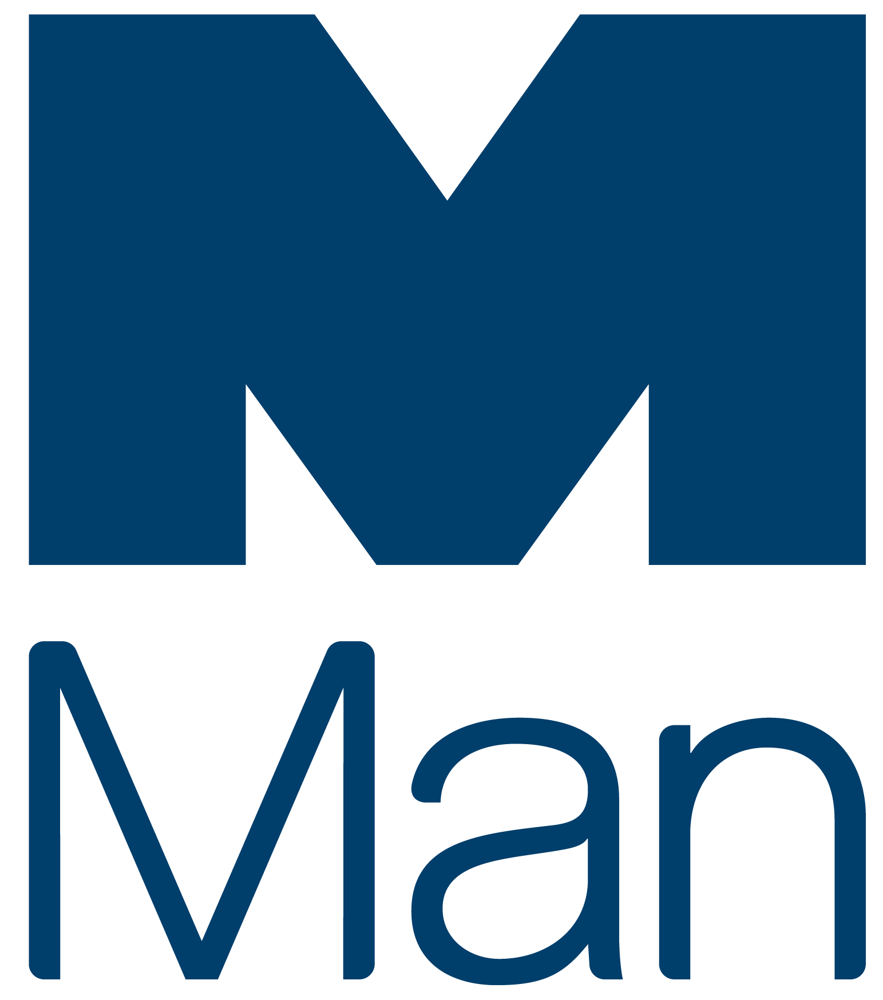
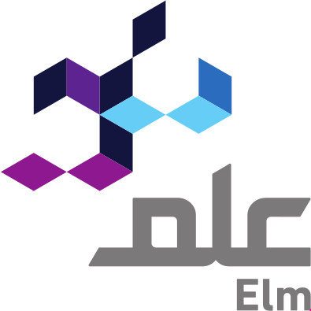
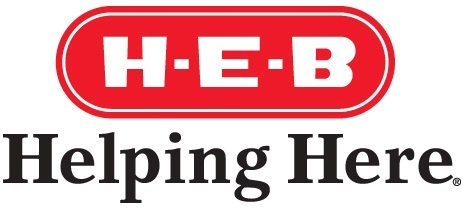

# Sponsors

PyData could not happen without the support of its amazing sponsors. Are you
interested in becoming a sponsor?  See our [sponsorship
prospectus](../assets/prospectus.pdf) or contact us at <a
href="mailto:global@pydata.org">global@pydata.org</a>.

# Diamond sponsors

[{: class="sponsor-image sponsor-image-right" style="height: 200px; margin-top: 0px"}](http://www.man.com/alpha-tech)

**Man Group** is a technology-empowered, global active investment management firm, which runs $108.3 bn (as at 30th June 2020) of client capital in liquid and private markets, managed by investment specialists based around the world. Headquartered in London, the firm has 15 international offices and operates across multiple jurisdictions. Our business has five specialist investment engines, which represent the range of our capabilities: Man AHL, Man Numeric, Man GLG, Man FRM and Man GPM.

---

# Platinum sponsors

[{: class="sponsor-image sponsor-image-left" style="height: 100px; margin-right: 20px;"}](https://community.ibm.com/community/user/datascience/home)

For over a century, **IBM** has led world-changing progress by relentlessly reinventing ourselves and enabling our customers' transformation. Share in our vision of AI for social good, our commitment to open source, and our mission of AI education for all. The IBM Data Science Community is the place for data scientists and developers to learn, share, and engage with their peers and industry leaders. Join the IBM Data Science Community and participate in shaping our digital future.

---

[{: class="sponsor-image sponsor-image-right" style="height: 105px"}](https://www.saturncloud.io)

**Saturn Cloud** is a managed data science and machine learning platform that automates DevOps and ML infrastructure engineering so your team can focus on analytics. Utilize Jupyter and Dask to scale Python for big data using the libraries you know and love, while leveraging Docker and Kubernetes so that your work is reproducible, shareable, and ready for production.

---

[{: class="sponsor-image sponsor-image-left" style="height: 170px; margin-bottom: 40px"}](https://www.metrostarsystems.com)

**MetroStar Systems, Inc (MetroStar)** is a leading provider of innovative technology across the federal government. For over two decades, our people have powered innovation through our core capabilities and practice areas. The solutions we develop integrate Human-Centered Design, DevOps, Cloud, and AI/ML capabilities to provide seamless delivery from ideation to production with no lapse in service. We are transforming the way data is disseminated for our customers by providing faster and more cost-effective deliveries.

---

[{: class="sponsor-image sponsor-image-right" style="height: 130px;"}](http://www.mozn.sa/)

**Mozn** is the leading advanced analytics product development firm in the Middle East, unlocking the true potential of data to deliver impact that transforms operations at businesses and government organizations. Mozn combines deep technical expertise with keen business acumen to help some of the region’s largest organizations solve their most pressing problems. Through our data products, clients change the way they work, and evolve to make the most of their data.

---

[{: class="sponsor-image sponsor-image-left" style="height: 70px;"}](http://www.blueyonder.com/)

**Blue Yonder** is the world’s leading, end-to-end, digital supply chain platform provider, enabling companies to better predict and pivot to quickly fulfill customer demand. Blue Yonder’s intelligent platform empowers companies to make smarter, faster business and commerce decisions to deliver more growth, profitability and reimagined customer experiences. With Blue Yonder, you can Fulfill your Potential™. Visit blueyonder.com.

---

[{: class="sponsor-image sponsor-image-right" style="height: 140px;"}](https://www.ovh.com/)

**OVHcloud**

**OVHcloud** provides everything you need for a successful online project: web hosting, domain names, dedicated servers, CDN, cloud environments, big data, and more.

---

# Gold sponsors
[{: class="sponsor-image sponsor-image-left" style="height: 85px"}](https://opensource.twosigma.com)

At **Two Sigma**, we use Open Source Software, and we’re passionate about giving back to the programming community. We want to make sure that the OSS projects that we and so many others rely on will still be functional far into the future. Supporting OSS can take many forms: making substantial contributions to projects we use regularly, open sourcing tools we’ve developed in house, and financially sponsoring non-profits that contribute to a healthy open source ecosystem. That’s why we are a Corporate Partner of NumFOCUS. Two Sigma is proud to support NumFOCUS sponsored projects pandas and Jupyter.

---

[{: class="sponsor-image sponsor-image-right" style="height: 250px"}](https://www.ing.nl/careers)

**ING** is a pioneer in digital banking and on the forefront being one of the most innovative banks in the world. As ING we have a clear purpose that represents our conviction of people’s potential. We don’t judge, coach, or to tell people how to live their lives. However big or small, modest or grand, we empower people and businesses to realize their vision for a better future. We made the promise to make banking frictionless, removing barriers to progress, and make people confident in their financial decisions. As a global bank we have a huge opportunity – and responsibility – to make an impact for the better. We can play a role by financing change, sharing knowledge, and innovating. Being sustainable is in all the choices we make—as a lender, as a partner and through the services we offer our customers

---

[{: class="sponsor-image sponsor-image-left" style="height: 150px"}](https://neo4j.com)

**Neo4j** is the world’s leading graph database. It helps the Intelligence Community build applications to meeting today’s evolving data challenges including artificial intelligence, network/IT resource management, identity and access management, supply chain management, real-time recommendations, criminal investigations, cyber security and master data management.

---

[{: class="sponsor-image sponsor-image-right" style="height: 150px"}](https://www.dataiku.com/)

**Dataiku** is one of the world’s leading AI and machine learning platforms, supporting agility in organizations’ data efforts via collaborative, elastic, and responsible AI, all at enterprise scale. At its core, Dataiku believes that in order to stay relevant in today’s changing world, companies need to harness Enterprise AI as a widespread organizational asset instead of siloing it into a specific team or role. To make this a reality, Dataiku provides one simple UI for data wrangling, mining, visualization, machine learning, and deployment based on a collaborative and team-based user interface accessible to anyone on a data team, from data scientist to beginner analyst.

---

[{: class="sponsor-image sponsor-image-left" style="height: 180px; margin-top: -10px;"}](https://www.apple.com/jobs/us/teams/machine-learning-and-ai.html)

**Apple**

We’re a diverse collection of people, reimagining what’s possible to help us do what we love in new ways. The people who work here have reinvented entire industries with the Mac, iPhone, iPad, and Apple Watch, and with services, including iTunes, the App Store, Apple Music, and Apple Pay.

---

[{: class="sponsor-image sponsor-image-right" style="height: 230px"}](https://www.elm.sa/en/Pages/default.aspx)

**Elm** is a leading company in digital transformation through a strategy based on innovation as a main pillar that delivers an integrated delightful customer experience through consultations, business & technical solutions, customized or on the shelf as well as outsourcing for both public and private sectors in many different fields, such as transportation, health, municipalities, commerce and others. Therefore, easing people’s lives by enhancing procedures and digitizing processes in the rapidly changing business world.

---

[{: class="sponsor-image sponsor-image-left" style="height: 170px"}](https://www.tesco-careers.com/technology/)

**Tesco Technology**

We solve real-world problems for hundreds of thousands of colleagues and millions of customers worldwide, whether they choose to shop with us in store or online. The work we do is critical to the business, and we’re looking to broaden our teams to help us to iterate, innovate and deliver more quickly.

---

# Sprint sponsors

[{: class="sponsor-image sponsor-image-right" style="height: 150px"}](https://newsroom.heb.com/)

**H-E-B** is a privately-held grocery retailer headquartered in San Antonio, Texas. With more than 400 stores in Texas and Mexico across its H-E-B, Central Market, Joe V’s, and Mi Tienda brands, the company is among the largest private companies in the United States. In 2018 H-E-B acquired grocery delivery service Favor and is making its digital offerings a core component of its continued expansion. H-E-B is known throughout Texas as a generous supporter of the local communities in which it does business — the company proudly donates 5% of its pre-tax profits to charity.

---

# Supporting sponsors

[{: class="sponsor-image sponsor-image-left" style="height: 80px"}](https://www.manning.com/)

**Manning** is an independent publisher of computer books for software developers, engineers, architects, system administrators, managers and all who are professionally involved with the computer business. The books we publish cover a huge range of topics that the modern developer needs; from languages and frameworks, to best practices for team leaders.
