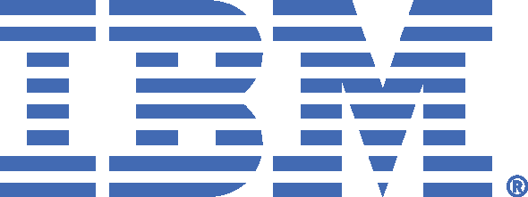
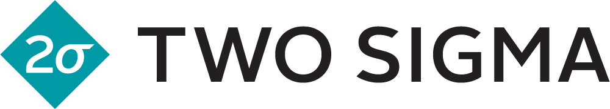
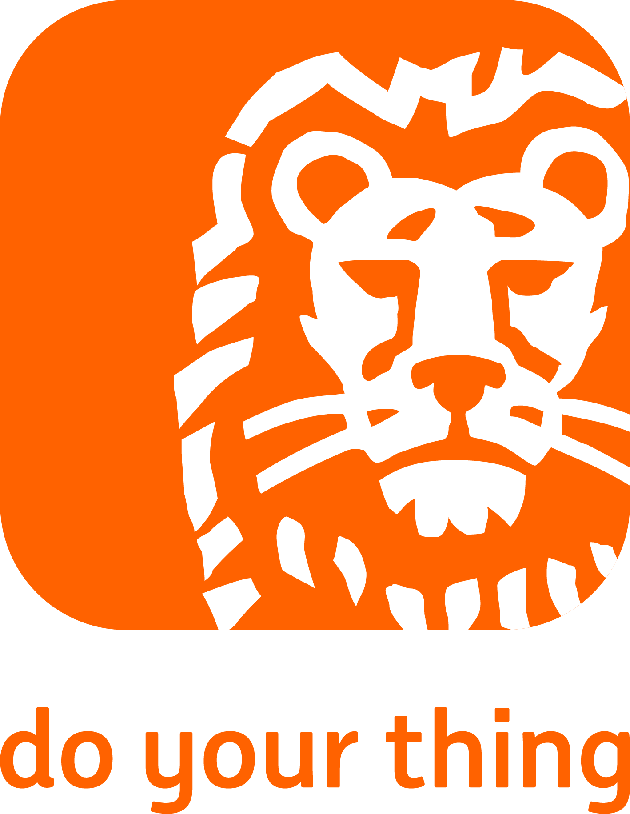
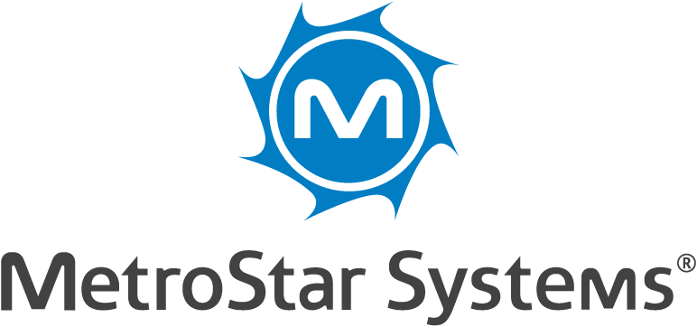

# Sponsors

PyData could not happen without the support of its amazing sponsors. Are you
interested in becoming a sponsor?  See our [sponsorship
prospectus](../assets/prospectus.pdf) or contact us at <a
href="mailto:global@pydata.org">global@pydata.org</a>.

# Platinum sponsors

[{: class="sponsor-image sponsor-image-left" style="height: 100px; margin-right: 20px;"}](https://community.ibm.com/community/user/datascience/home)

For over a century, **IBM** has led world-changing progress by relentlessly reinventing ourselves and enabling our customers' transformation. Share in our vision of AI for social good, our commitment to open source, and our mission of AI education for all. The IBM Data Science Community is the place for data scientists and developers to learn, share, and engage with their peers and industry leaders. Join the IBM Data Science Community and participate in shaping our digital future.

---

[{: class="sponsor-image sponsor-image-right" style="height: 105px"}](https://www.saturncloud.io)

**Saturn Cloud** is a managed data science and machine learning platform that automates DevOps and ML infrastructure engineering so your team can focus on analytics. Utilize Jupyter and Dask to scale Python for big data using the libraries you know and love, while leveraging Docker and Kubernetes so that your work is reproducible, shareable, and ready for production.

---

# Gold sponsors
[{: class="sponsor-image sponsor-image-left" style="height: 85px"}](https://opensource.twosigma.com)

At **Two Sigma**, we use Open Source Software, and we’re passionate about giving back to the programming community. We want to make sure that the OSS projects that we and so many others rely on will still be functional far into the future. Supporting OSS can take many forms: making substantial contributions to projects we use regularly, open sourcing tools we’ve developed in house, and financially sponsoring non-profits that contribute to a healthy open source ecosystem. That’s why we are a Corporate Partner of NumFOCUS. Two Sigma is proud to support NumFOCUS sponsored projects pandas and Jupyter.

---

[{: class="sponsor-image sponsor-image-right" style="height: 250px"}](https://www.ing.nl/careers)

**ING** is a pioneer in digital banking and on the forefront being one of the most innovative banks in the world. As ING we have a clear purpose that represents our conviction of people’s potential. We don’t judge, coach, or to tell people how to live their lives. However big or small, modest or grand, we empower people and businesses to realize their vision for a better future. We made the promise to make banking frictionless, removing barriers to progress, and make people confident in their financial decisions. As a global bank we have a huge opportunity – and responsibility – to make an impact for the better. We can play a role by financing change, sharing knowledge, and innovating. Being sustainable is in all the choices we make—as a lender, as a partner and through the services we offer our customers

---

[{: class="sponsor-image sponsor-image-left" style="height: 170px; margin-bottom: 40px"}](https://www.metrostarsystems.com)

**MetroStar Systems, Inc (MetroStar)** is a leading provider of innovative technology across the federal government. For over two decades, our people have powered innovation through our core capabilities and practice areas. The solutions we develop integrate Human-Centered Design, DevOps, Cloud, and AI/ML capabilities to provide seamless delivery from ideation to production with no lapse in service. We are transforming the way data is disseminated for our customers by providing faster and more cost-effective deliveries.
